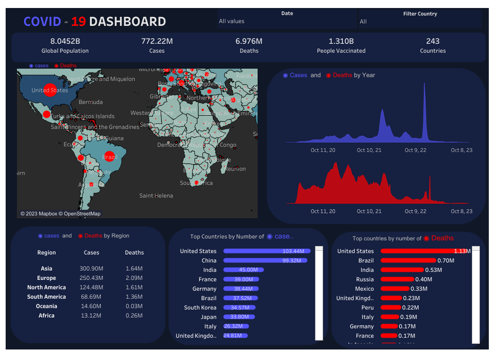

# COVID-19 Data Exploration

## Introduction
This project delves into the exploration of COVID-19 data spanning from 2020 to 2023, aiming to unravel temporal trends, regional disparities, and significant milestones in the pandemic. Leveraging SQL queries, I unveil insights into the dynamics of cases, deaths, and vaccination efforts and further vizualize the findngs in tableau to effectively communicate the findings

## Dataset collection
The dataset use in this project is from Ourwordindata page which is  [available here](https://ourworldindata.org/coronavirus). It encompasses global COVID-19 records, including infection cases, deaths, and vaccination statistics, etc. Data spans four years, offering a comprehensive view of the evolving pandemic.

## Data Preparation
The inital Data preparation was done after the dataset was downloaded in microsoft excel, this involve
1. Create two other csv file (Covid cases and CovidVaccination)
2. columns in the covidcases worksheet  (iso_code,	continent,	location,	population	,date,	new_cases	,total_cases	    ,total_deaths	,new_deaths ) 
3. The CovidVaccination is consist of columns (iso_code,	continent,	location,	date	,total_vaccinations,	people_vaccinated	,people_fully_vaccinated,	total_boosters	new_vaccinations)

## Data Loading into SQL Server
1. Download SQL server using this [link](https://www.microsoft.com/en-us/sql-server/sql-server-downloads), step by step tutorial on how to get started with SQL server is in this [link](https://www.sqlservertutorial.net/install-sql-server/)
2. Create Database Covid19
3. Import the CovidCases , the workbook created in the Data preparation step
4. Import The covidVaccination

## Data Cleaning and Analysis SQL Queries
The project employs SQL queries to clean, extract and analyze data, showcasing the versatility of SQL in handling complex temporal and regional analyses.
View the [SQL Query Here](https://github.com/job-moses/COVID-19-Data-Exploration-SQL/blob/main/COVID%20Portfolio%20Project%20-%20Data%20Exploration.sql)

## Data Visualization in Tableau

[Click](https://public.tableau.com/app/profile/job.moses/viz/Covid19Dashboard_17024391109300/COVID19DASHBOARD) to view in my Tableau Public

### Key Findings

#### Global and Regional Insights:

**Global Overview:**
- The global COVID-19 landscape spans 243 countries, documenting 772.22 million cases, 6.976 million deaths, and 1.31 billion individuals vaccinated.

**Continental Impact:**
- Asia, Europe, and North America emerge as the top three continents with the highest COVID-19 case numbers.

**Population Metrics:**
- Oceania, Europe, and North America exhibit the highest population infection rates, while Africa reports the lowest.

**Mortality Rates:**
- South America, North America, and Europe face the highest population death rates, in contrast to Africa, which has the lowest.

**Recovery Trends:**
- Africa and South America present the lowest recovery rates among continents.

**Fatality Risk:**
- The risk of mortality post-COVID-19 contraction is notably highest in Africa, followed closely by North America.

**Vaccination Landscape:**
- South America leads in vaccination rates with 85.95%, followed by Asia (78.1%), North America (76.38%), and Africa with the lowest rate at 38.98%.

#### Country-Specific Observations:

**Top Countries by Cases:**
- The United States, China, India, France, and Germany hold the top five positions in terms of recorded COVID-19 cases.

**Top Countries by Deaths:**
- The United States, Brazil, India, Russia, and Mexico emerge as the top five countries with the highest COVID-19 death tolls.

#### Temporal Analysis:

**2020-2023 Trends:**
- The four-year analysis indicates an exponential increase in COVID-19 cases and deaths from 2020 to 2022, with a subsequent decrease in 2023.
- The highest numbers of COVID-19 cases and deaths were recorded in 2022.
- A consistent rise in vaccination numbers is observed from 2021 to 2023.

**Historical Death Peaks:**
- Historically, the highest COVID-19 death tolls occurred in January 2021, followed by May 2021 and April 2021.

**July 2021 Milestone:**
- July 2021 signifies a pivotal moment with a remarkable 706-fold increase in COVID-19 cases compared to the previous month. This month also records the highest number of deaths from the previous month.

**Vaccine Rollout Timeline:**
- The availability of the first dose of COVID-19 vaccines took place after 11 months, marking a significant milestone in December 2020.

## Conclusion

As we navigate the intricate tapestry of data, the story that unfolds is not merely a chronicle of numbers, but a testament to the shared resilience and unwavering spirit of humanity. In the ebb and flow of global challenges, the saga of the COVID-19 pandemic is etched into the collective consciousness of 243 nations.

In every statistic, there lies a narrative of courage, sacrifice, and triumph. From the relentless battles waged in the hospital corridors to the quiet victories achieved through vaccination efforts, each digit represents a life touched, a community tested, and a world forever changed.

As we gaze upon the continents, we witness not only the disparities in infection rates but also the unyielding determination to overcome. In Africa's steadfastness and North America's resilience, we find stories of courage written in the face of adversity. It is in South America's vaccination prowess, Asia's solidarity, and Europe's enduring spirit that we discover the promise of a brighter tomorrow.

The journey through time, from the exponential rise in 2022 to the historic milestones of 2021, is a vivid portrayal of the human spirit's triumph over the darkest hours. July 2021, a month etched in the annals of our shared history, stands as a beacon of hope—a moment where humanity faced adversity head-on, witnessed an unparalleled surge, and emerged stronger on the other side.

In the rise and fall of numbers, we find a reflection of our collective strength and vulnerability. The availability of the first vaccine dose in December 2020 marks not just a scientific achievement but a symbol of hope—a testament to what we can achieve when we unite against a common foe.

So, as we close this chapter of analysis, let us not forget the faces behind the statistics, the stories within the trends, and the unspoken resilience that echoes across continents. Our journey through this data serves as a reminder that, in times of crisis, our shared humanity shines brightest.

As we press forward into an uncertain future, let the lessons learned from this data guide our steps toward a world where health knows no borders, compassion transcends boundaries, and the strength of the human spirit prevails against all odds. For in this intricate web of information, we find not just numbers but narratives—a narrative of hope, tenacity, and the unbreakable bonds that tie us together as one global family.

----------------------------------------------------------------------------------------------------------------------------------------
`Job Moses Ubeh`
